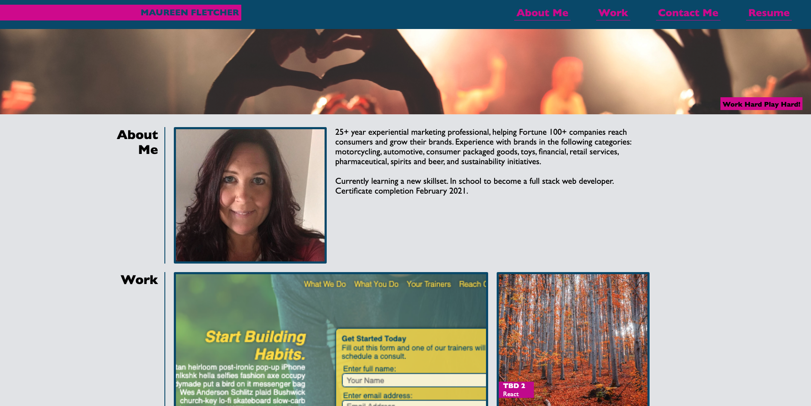

# Personal Portfolio

### Personal Portfolio is a repository holding the HTML and CSS code, as well as image assets for Maureen Fletcher's personal page that outlines work experience.  This is the assignment for Module 2 end of lesson Challenge.  

## Maureen Fletcher Personal Portfolio Landing Page
 "Personal Portfolio")

## Introduction
#### The Challenge requested the student create a site using best practices learned in Module 2, as well as integrating previous learnings.  This includes HTML and CSS, ensuring use of new learnings to include grids and responsive layouts.

## Contributing
#### This is an individual (not group) project.  Students can contribute to the project by completing Module 2 lessons and using learnings to complete the assignment, optimizing code.

## Help
#### If encountering any roadblocks, the student has a variety of support options.  The live learnings were lacking this class.  Grids and formatting for responsive loyouts is very complex and reading and self-learning did not fully support this students learning needs.  The official documentation was too vague in some cases, and too complex in others presenting options that included many new unknown elements and coding that the student has not been taught yet and unable to utilize at this beginner stage of her education.
  * Reviewing best practices for coding
  * Requesting assistance through TAs Office Hours, Ask BCS LAs, Tutor assistance
  * Referencing official documentation

## Version History
  * 0.1
    * Initial release

## License
#### The project is licensed to the owner:
[Xperiential Worldwide] (http://xperientialworldwide.com)

